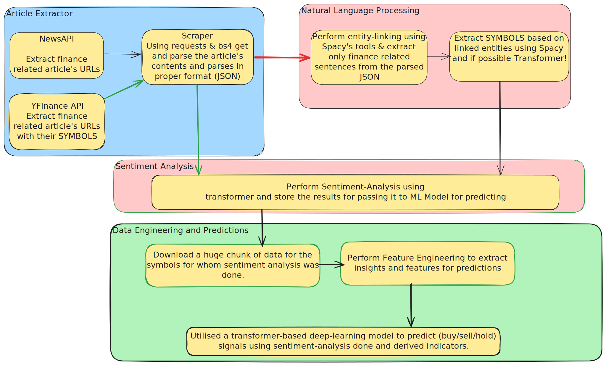

# Raptor

## Overview

Raptor is a comprehensive pipeline designed for automated financial news extraction, robust web content scraping, and advanced Natural Language Processing (NLP) analysis to Analyze the Market.

## Features

  * **Financial News Extraction:** Automated fetching of financial news metadata (titles, URLs, authors) from popular APIs.
      * Integration with **NewsAPI** for general financial news.
      * Integration with **Yahoo Finance News** for company-specific news (using S\&P 500 tickers).
  * **Concurrent Web Scraping:** A highly efficient `article_scraper` module designed to fetch full article content from extracted URLs in parallel batches.
      * **Robust Error Handling:** Manages common scraping challenges including HTTP errors (e.g., 404, 500), network issues, and request timeouts.
      * **Advanced Content Extraction:** Employs sophisticated HTML parsing strategies using BeautifulSoup to maximize the extraction of meaningful text content from diverse web page structures, handling cases where content is not simply in `<p>` tags.
  * **NLP Pipeline:** A core NLP module to process scraped articles for deeper insights.
      * **Sentiment Analysis:** Utilizes a pre-trained Hugging Face Transformer model (`sentiment_analyzer`) to determine the sentiment (Positive, Negative, Neutral) of article content.
          * **Long Text Handling:** Automatically chunks articles that exceed the model's context window using `RecursiveCharacterTextSplitter`, analyzes each chunk, and intelligently aggregates the sentiment results to provide an overall sentiment for the entire article.
      * **Entity Linking (Initial):** Basic functionality for identifying and linking financial entities within the text using a spaCy model (`entity_linker`). This lays the foundation for more targeted analysis of companies, products, or financial concepts mentioned in the news.
  * **Modular ML Components:** Dedicated classes for key machine learning tasks:
      * `sentiment_analyzer`: Encapsulates the sentiment classification model.
      * `sentence_embedder`: Generates numerical embeddings for text, also handling long texts by chunking and averaging embeddings to ensure comprehensive representation.
      * `entity_linker`: Handles the identification and linking of named entities.
  * **Structured Output:** All processed data and NLP analysis results are stored in clean, easy-to-parse JSONL (JSON Lines) format.

## System Architecture

The Raptor pipeline follows a sequential, modular architecture to ensure clear separation of concerns and efficient data flow.

1.  **Extraction Layer:** News metadata (URL, Title, Author) is fetched from external APIs (NewsAPI, Yahoo Finance).
2.  **Scraping Layer:** The extracted URLs are concurrently processed to scrape the full article content.
3.  **NLP Processing Layer:** Scraped content undergoes sentiment analysis and optional entity linking.
4.  **Reporting Layer:** Final analysis results are stored in structured reports.

**Detailed System Design:**



## Current Progress

As of the current development phase, the following core functionalities have been implemented and tested:

  * **News Extraction:** Both `newsapi_extractor` and `yfnews_extractor` are functional, successfully fetching news metadata and storing it in JSONL files.
  * **Web Scraping:** The `article_scraper` is robust. It performs concurrent HTTP requests, handles various network and HTTP errors, and employs advanced BeautifulSoup logic to extract article content. It processes the entire input file in a single pass (resumability is a planned future enhancement).
  * **NLP Pipeline:**
      * The `nlp_pipeline` class is capable of reading processed articles.
      * **Sentiment Analysis** is fully integrated, including the automatic chunking of long texts and aggregation of sentiment results.
      * **Entity Linking** has been set up with a basic spaCy model integration, ready for further refinement and domain-specific entity recognition.
  * **Modular Design:** The project adheres to a modular structure, with clear separation between data extraction, scraping, and NLP components, facilitating maintainability and future expansion.
  * **Error Handling & Logging:** Comprehensive `try-except` blocks and detailed logging are implemented across all modules to ensure robust operation and easy debugging.

## Getting Started

Follow these steps to set up and run the Raptor pipeline locally.

### Prerequisites

  * conda (I used 25.3.1)

### Installation

1.  **Clone the repository:**
    ```bash
    git clone https://github.com/SuriyaaMM/Raptor.git
    cd Raptor
    ```
2. **Install environment.yaml**
3.  **Download spaCy model:**
    The NLP pipeline uses a spaCy model. Download the small English model:
    ```bash
    python -m spacy download en_core_web_sm
    ```

### Configuration (`Environment.json` file)

Create a `Environment.json` file in the root directory of the project and add your API keys and configuration settings.

```
{
    "NEWSAPI_API_KEY" : "<YOUR_NEWSAPI_API_KEY>",
    
    "MASTER_DB" : {

        "NAME" : "<YOUR_NAME>",
        "USER" : "<USER>",
        "HOST" : "<HOST>",
        "PORT" : "<HOST>"
    }
}
```

**Note:** Replace `YOUR_NEWSAPI_API_KEY` with your actual key from [NewsAPI.org](https://newsapi.org/).
